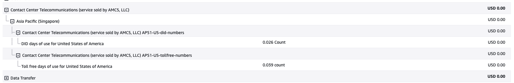

## 文件
- https://pkg.go.dev/github.com/aws/aws-sdk-go-v2/service/connect

## workshop
- https://repost.aws/knowledge-center/connect-outbound-calls-api
- https://aws.amazon.com/tw/blogs/contact-center/automating-outbound-calling-to-customers-using-amazon-connect/

# 費用
> 電話號碼還蠻複雜，有地區限制

## aws connect 固定費用 (分鐘)
- 0.018

## 電話號碼
- 直接內線撥號(DID)
    - 分配給特定用戶或部門的電話號碼，用於直接撥通目標分機或部門，而不需要經過總機接線員或自動話務系統。
    - 主要用於 公司內部的通訊需求，幫助用戶直接聯繫到特定的員工或團隊。
    - ex: 每個員工或部門可以有自己的獨立號碼。
- 免付費電話號碼(TFN)
    - 通話費用由企業負擔
    - 只能在本地 (本地通話費)
- 環球國際免費電話號碼(UIFN)
    - 通話費用由企業支付
    - 可跨國 (會有跨國際的通話費)
    - 只能用於 inbound calls only

## 傳入呼叫 (每分鐘)
- 有分成 DID, TFN, UIFN 等費率

## 傳出呼叫 (每分鐘)

## 範例情境: 
1. 客戶打過來給客服
2. 客服接起電話，花了三分鐘對話 => 3 * 0.018 (aws connect 服務用量費用)
3. 客服轉接給指定部門，花了四分鐘 (轉接一開始就計費，包含對話時間) => 4 * 0.018 (aws connect 服務用量費用)
4. 使用 電話號碼 => 1天 * N
5. 傳入呼叫費用 => 7(分鐘) * N
6. 傳出呼叫費用 => 4(分鐘) * N 

## 使用一天的相關費用 (api 撥打電話失敗)
- 雖然有建立 instance，看樣子 instance 並沒有計費

- [ ] : 所以最好的方式就是，我在日本申請 instance 然後向 support 申請電話號碼，申請完畢後，執行 api 測試即可
    - 按照官網說明 日本撥打台灣電話是 USD 1.2 元